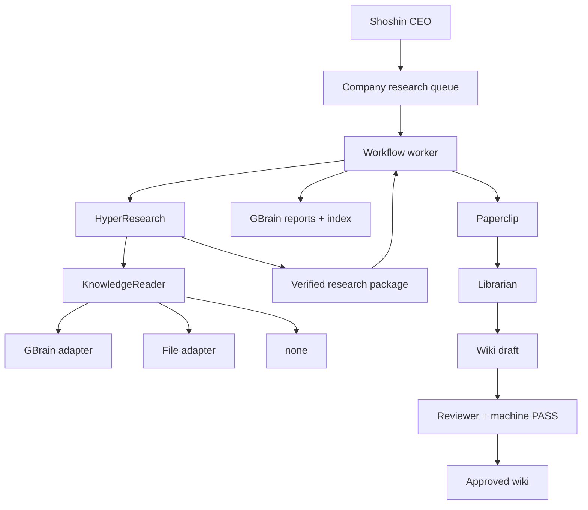
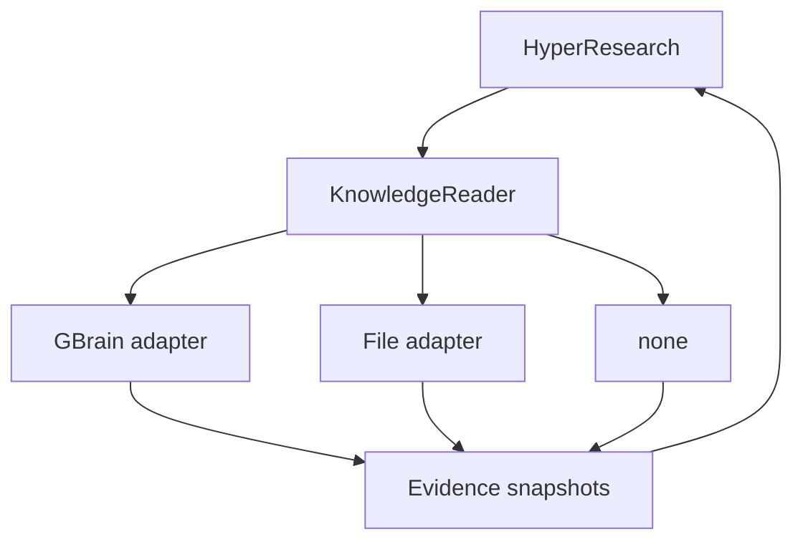

# SPEC 2.2 — KnowledgeReader, verified package, company workflow worker

Implementer contract. Do not re-grill Spec 1 (host pipeline, ModelRuntime, no wiki-write in the fork) or Spec 1.5 (SearXNG JSON search, crawl4ai fetch). Spec 2.1 (company workflow inside `hpr`) is superseded. Do not implement until the operator says `go`.

**Revision 2.2.7:** PR #3 second review: worker package recovery uses `run_hpr` / awaited `execute_run` (never drop the coroutine); index YAML is frontmatter-only (Markdown body is not concatenated; unparseable index stops, not empty catalog); recovery never mints new Spec 1 binds; package includes cited web/vault evidence, not only KnowledgeReader snapshots.

Tracker: `/opt/data/.scratch/hyperresearch-fork/`
Glossary: `CONTEXT.md`
Card: `issues/04-shoshin-memory-publish.md` (`ready-for-agent`)
Follow-up (not this sitting): Stark `research/` prefix, Jarvis 7703 trip card, multi-worker job claims.

**Baseline:** `00PZ/hyperresearch` `origin/main` after Spec 1.5 merge (`feat: SearXNG JSON search adapter (Spec 1.5)` #2, `6d480d6`). New feat branch from that tip.

Coding: omp on `ssh dev`, feat worktree under `/home/vdm/git/`. codegraph on that tree before symbol edits.

**Seams (operator-confirmed):**

1. Host action **kinds** stay `search` / `fetch` / `evidence_read` / `complete`. Company knowledge is an injected **reader**, not a new kind.
2. **`hpr` lifecycle ends at Spec 1 `verified` plus a durable research package.** No GBrain `put_page`, no Paperclip, no queue claim inside the engine or `hpr` CLI.
3. Pipeline core depends on a **KnowledgeReader** protocol. GBrain is one adapter. A file adapter (and `none`) must run without GBrain or Paperclip installed.
4. **Workflow worker** (separate entry point, same repo allowed) claims company work, invokes `hpr`, publishes the package, dispatches Librarian. Not an `hpr` subcommand.
5. CEO `/v1/runs` is not ModelRuntime.
6. Research `verified` stays Spec 1. Publication and ingest are **workflow** fields, never `blocked_on`.

---

## Problem Statement

Spec 1 made research a workstation CLI. Spec 1.5 made web discovery SearXNG JSON. Spec 2.1 put Shoshin queue drain, GBrain publish, and Paperclip **inside `hpr`**. That made the research engine depend on one company’s dispatch graph. Agent independence (no Claude Code) is not knowledge-backend independence.

The engine still needs existing company knowledge, then a durable verified result. What the company does with that result (queue, publish, Librarian) is workflow, not research.

## Solution

**HyperResearch** runs the 16-step graph, tracks evidence, verifies, and writes a **verified research package** (report bytes, evidence snapshots, verification metadata, stable `company` + `run_id`). Memory-first search uses a **KnowledgeReader**. Web search for host-validated gaps stays Spec 1.5 SearXNG. Fetch stays crawl4ai.

**GBrain** is optional: an adapter that implements KnowledgeReader (and, in the integration layer, publication). Standalone `hpr` researches with `none` or a file reader. No GBrain client in pipeline core imports. No Paperclip import anywhere under the `hpr` console script.

**Workflow worker** is company integration. First deploy: a CLI process on `ssh dev`. Later: the same worker in a Kubernetes pod/Job. It owns the research queue, invokes `hpr`, publishes the package to GBrain, maintains the research index, and POSTs Paperclip for Librarian. Restarting the worker does not rerun completed research. Retrying publication does not call ModelRuntime.

CEO enqueues via HTTP MCP (queue pages). CEO does not run `hpr`.

There is **no** HyperResearch → Paperclip edge.

## User Stories

### Engine (`hpr`)

1. As the operator, I want a new branch from `origin/main` after Spec 1.5, so that company integration does not reopen SearXNG.
2. As the operator, I want `--company shoshin` on `hpr run` to select a dedicated vault root and a KnowledgeReader config, so that FTS cannot see Stark notes.
3. As the pipeline, I want the first investigation loop to be memory-only via KnowledgeReader, so that we sharpen existing knowledge before web search.
4. As the pipeline, I want `hpr` with `knowledge=none` (or omitted `--company`) to keep Spec 1.5 behaviour, so that the engine runs without GBrain or Paperclip installed.
5. As the host, I want each snapshot to carry a **document identity** and **provenance** (underlying URL/article, possibly several), so that known shared provenance is one lineage, known distinct provenance is independent, and **missing provenance is unknown** (not a free independence credit).
6. As the host, I want a Shoshin reader that is asked for a Stark wiki or employee slug to return no hits, so that isolation is mechanical.
7. As the host, I want a durable gap list `stale` | `uncovered` | `contradicted` with `memory_refs` / `memory_search`, so that web use is not a hit-count.
8. As the host, I want SearXNG refused until a host-accepted `gap_id` exists, so that one `search` kind cannot fan out to web.
9. As the operator, I want `verified` to mean Spec 1 full gates only, so that a GBrain outage cannot un-verify research.
10. As the engine, I want an atomic verified package (versioned manifest + artifacts) before `hpr` may expose `verified` to the worker, so that a crash cannot leave `verified` without a reconstructable package.
11. As CI, I want FakeRuntime + FakeKnowledgeReader tests that never import GBrain or Paperclip, so that core pytest does not need company credentials.
12. As the host, I want `evidence_read` of a knowledge snapshot id that this run retrieved to quote that snapshot, so that cite-check binds frozen bytes.
13. As the host, I want `evidence_read` of a Stark slug on a Shoshin run to return prohibited (not `note_not_found` of a leaked page).
14. As the pipeline, I want `company` on every manifest, checkpoint, gap record, and package, so that resume cannot mix companies.
15. As schema-adjacent CI, I want omitting the GBrain extra to leave `hpr run` importable, so that package separation is real.

### Workflow worker (integration)

16. As CEO, I want to enqueue a named topic via HTTP MCP `put_page` of a queue item, so that cadence stays on CEO and execution stays on the worker + `hpr`.
17. As the worker, I want to harvest Open-gaps into queue items `origin=wiki-gap`, so that known holes get research without a hit-count.
18. As the worker, I want one company lock (or one replica) covering claim through ingest checkpoint, so that two workers cannot both start `hpr run`.
19. As the worker, I want to invoke `hpr` only when research is not already `verified` with a complete package, so that publish retry is cheap. `verified` with a missing package reconstructs once; if `package.status=invalid` is already recorded, drain does not rebuild (explicit rebuild only). No ModelRuntime.
20. As the publisher, I want HTTP MCP with a Shoshin-scoped Bearer, so that ssh-dev does not `kubectl exec`.
21. As the publisher, I want skip/conflict of the GBrain report to use the envelope’s frozen published body hash, so that engine `package_digest` is not the `put_page` key.
22. As the catalog, I want `companies/shoshin/research/index` to list published reports only, merged under the worker lock.
23. As the worker, I want Paperclip POST Librarian after publication `ok`, with ingest dispatch (`idle` first POST; `in_flight`/`uncertain` reconcile; `failed` only on explicit retry), so that `hpr` never sees Paperclip.
24. As Librarian, I want wiki-draft to `get_page` `research_slug` and distill into the seed draft.
25. As schema, I want types `research-report`, `research-queue`, `research-index` on pack `company-brain` before the worker publishes, so that pages are not `analysis`.

## Implementation Decisions

### Packages and entry points

- Pipeline core (`hyperresearch.pipeline`, `hyperresearch.cli` for `hpr`): **no** GBrain client, **no** Paperclip client, **no** queue drain, **no** `hpr publish`, **no** `hpr ingest-retry`. Grep of that tree for Paperclip URLs/ids = fail.
- `KnowledgeReader` protocol lives in core (tiny). Implementations: `none`, `files`, `gbrain` (gbrain is an **optional extra**, lazy-imported only when configured).
- Workflow worker: separate console script (this sitting: `hr-workflow`). Same git repo allowed. It may import the GBrain extra and Paperclip. Production `drain` **invokes the same `execute_run` path as `hpr run`**, passing the configured AgentRuntime and KnowledgeReader from company config (`knowledge_backend` / vault). It does **not** hard-code `FakeRuntime(default=complete)` and does **not** default `knowledge_backend=none` when GBrain/files is configured. `FakeRuntime` is an explicit `--runtime fake` / test / dry-run choice. The worker does not call ModelRuntime itself; it starts `hpr`/`execute_run`. It reads the package from the run directory.
- `hpr` subcommands must not grow `queue`, `publish`, or `ingest-retry`.

### Company and vault (engine)

- Allowlist this sitting for `--company`: `shoshin` only. Other values are `blocked_on=config`.
- Omitting `--company` keeps Spec 1.5 (no KnowledgeReader company memory, no package requirement beyond Spec 1 artifacts).
- Operational vault for a Shoshin run is a **dedicated root** (`HYPERRESEARCH_SHOSHIN_VAULT`). Not the Stark/Jarvis vault with a filter. If that env (or equivalent config) is **absent**, both `hpr run --company shoshin` and `hr-workflow drain` **fail closed** before starting a company run. They must **not** fall back to `Vault.discover()` / the ambient workspace vault.
- Manifest stores `company`, vault root, `knowledge_backend` (`none` | `files` | `gbrain`).

### KnowledgeReader

Capabilities the pipeline may call:

- `search(query, scope) -> {ok, hits[], hit_count, error?}`
- `get(ref) -> {ok, body, namespace, document_id, type, content_hash, provenance, error?}`

`hits[]` items: `{ref, namespace, document_id, type, content_hash, provenance, title?}`.

- `namespace`: company/backend scope (GBrain `source_id=shoshin` is this). **Not** an independence key.
- `document_id`: stable document identity (GBrain page slug, file path). Two different slugs are two documents even if `namespace` is the same.
- `provenance`: list of underlying evidence identities when known (canonical URLs, article ids). Empty = **unknown**. A synthesizing page should carry the underlying identities relevant to the cited claim, not only its own `document_id`.

Independence clustering uses **`document_id` and non-empty `provenance`**, never `namespace` / company `source_id`.

- Same `document_id` = one lineage.
- Any shared non-empty provenance identity = one lineage (wiki page + research-report of that article).
- Known distinct provenance identities (no overlap) = independent sources.
- **Empty provenance is unknown independence.** Distinct `document_id`s with empty provenance remain two documents and may be cited for context. They **must not** satisfy a multi-source independence requirement merely because slugs differ. Company knowledge must not corroborate itself by omitting provenance.

Backends:

- `none` (**deliberate** config): memory `search` returns empty-success `{ok: true, hit_count: 0, hits: []}` **without consulting a knowledge store**. An accepted `uncovered` gap may open web.
- `files`: read a configured tree of markdown; no GBrain. Isolation uses the **real** company path `companies/stark-industries/` (and resolved absolute paths under that prefix), **not** a shortened `companies/stark/` substring. A Shoshin `FilesReader` must not `search` or `get` `companies/stark-industries/employees/jarvis/` (or other Stark Industries employee/wiki paths). A healthy search with zero matching files is `{ok: true, hit_count: 0}`. HTTP/IO/`ok: false` is **not** empty-success and **must not** open SearXNG.
- `gbrain`: HTTP MCP `search` / `list_pages` / `get_page` with Shoshin-scoped Bearer. Tools for **read** only. Prefixes: `type=wiki` under `companies/shoshin/knowledge/wiki/`, `type=research-report` under `companies/shoshin/research/reports/`. Skip `research-index` and `research-queue`. No `knowledge/raw` crawl. No wiki `put_page`. Adapter maps GBrain `source_id` → snapshot `namespace`, page slug → `document_id`. A healthy search with zero hits is `{ok: true, hit_count: 0}`. JSON-RPC **and** MCP tool errors fail closed: HTTP 200 with `result.isError: true` is a **backend error** (`ok: false`), never unwrapped as text/`structuredContent`. Cover **read and write** tools. Malformed or unrecognized search payloads must **not** become `{ok: true, hits: [], hit_count: 0}`.

`gbrain` or `files` **unavailable or misconfigured** (`ok: false`, timeout, missing credentials, missing tree): persist the error. Do **not** convert that error into a successful zero-hit search. Do **not** accept an `uncovered` gap from that failure. Do **not** open SearXNG as a bypass.

Any backend may return a **successful** zero-hit search (`ok: true`, `hit_count: 0`). Only configured `none` may produce that result without consulting a knowledge store. Backend errors must never be converted into successful empty results. A successful zero-hit from `gbrain` or `files` may justify an `uncovered` gap (`memory_search`).

Shoshin gbrain/files readers never return Stark Industries source pages (`companies/stark-industries/…`).

### Memory pass then gaps then web (engine)

- Host action **kind** `search` unchanged.
- On a Shoshin run, `search` mode:
  - `memory` (default until a gap id is bound): company vault FTS + KnowledgeReader. No SearXNG.
  - `web`: only when args include a `gap_id` on the host-validated list for this `company+run_id`. Then Spec 1.5 SearXNG JSON.
- Persist `gaps.json`: `{id, question, reason: stale|uncovered|contradicted, memory_refs[], memory_search?}`.
  - `memory_refs`: snapshot refs this run already retrieved. Never a memory-search record.
  - `memory_search`: `{query, scope, ok: true, hit_count: 0, retrieved_at}` only when `ok` is true and `hit_count` is 0.
  - `stale` / `contradicted`: non-empty `memory_refs`; `memory_search` ignored if present.
  - `uncovered`: non-empty `memory_refs` **or** valid `memory_search`. Invalid `memory_search` ignored when `memory_refs` non-empty.
- Host `upsert_gap` **shape is not enough**. Before persisting an accepted gap, resolve every `memory_ref` against **durable company+run-scoped host snapshots** for this run (the files the host recorded, not the model’s object). Resolve `memory_search` against a **host-recorded** successful zero-hit search for this run (`query`/`scope`/`ok`/`hit_count`). Fabricated refs, foreign-run refs, or a `memory_search` the host never performed → reject the gap. Do not open web. A model that sends `gap={id:'invented',…,memory_refs:['never-retrieved']}` plus `gap_id='invented'` with no host memory search must not trigger SearXNG.
- Host also rejects unknown ids, reasons outside the enum, `stale`/`contradicted` with empty `memory_refs`, or `uncovered` with empty `memory_refs` and no valid `memory_search`. Empty accepted list = no web.
- Sufficiency is the accepted gap record, not `len(hits)`.

### Company evidence in Spec 1 gates (engine)

- Every KnowledgeReader page used as evidence is copied at retrieval into a run-local snapshot: `{ref, namespace, document_id, type, content_hash, retrieved_at, body, provenance}`. Cite-check and independence use **that snapshot**.
- Remote change after snapshot does not change the bound hash.
- Independence: cluster on `document_id` and non-empty provenance identities. Shared provenance = one lineage. Known distinct provenance = independent. **Empty provenance is unknown** — two different slugs with empty provenance do **not** satisfy the independence gate. Company `source_id` / `namespace` must not collapse or inflate independence.
- A full `--company shoshin` FakeRuntime run with FakeKnowledgeReader must cite at least one snapshot and reach Spec 1 cite-check + independence.

### Verified research package (engine handoff)

The worker must not need GBrain layout fields or mutable engine checkpoints. `hpr` does not publish.

**Engine package** (`hyperresearch.package.v1`) owns: `company`, `run_id`, frozen report bytes, evidence snapshot bodies, verification bindings, artifact hashes, `package_digest`.

**Worker publication envelope** (frozen by the worker before the first GBrain write) owns: destination slug, index row, `published_at`, frozen **published report bytes** (engine report plus whatever the worker inserts for GBrain), body hashes of those bytes, which snapshot/report bytes get `put_raw_data`, publication/dispatch progress.

Do **not** put GBrain report slug, index row, or `published_at` in the engine package.

#### Manifest (versioned)

`manifest.json` fields:

- `schema`: `hyperresearch.package.v1`
- `company`, `run_id`
- `report`: `{path, sha256}`
- `snapshots`: `[{document_id, namespace, type, provenance, path, sha256}]` — **all cited evidence**, including KnowledgeReader pages **and** web/vault sources recorded in `evidence.json` / `vault.notes_dir`. A verified report that cites `[[src-note]]` must export those source bytes (or a sufficient durable reference) into the package. `load_snapshots` of the KnowledgeReader directory alone is not the package inventory.
- `verification`: `{verified_hash, cite_check_bind, independence_bind, verified_at}` — the Spec 1 bind hashes/ids that made the run `verified`
- `package_digest` — inserted **after** hashing

**Canonical payload** (no `package_digest`): UTF-8 JSON, sorted keys, no insignificant whitespace, timestamps frozen once. `package_digest` = hex SHA-256 of that byte string. Reloading the package recomputes the same digest.

A shared validator (core, imported by the worker) reads **only** this package directory: recompute file hashes, recompute digest, **require** `verification` fields, and check those fields against the frozen report/evidence using **Spec 1 binding rules** (cite-check bind and independence bind over the packaged bytes). Self-consistent file hashes with empty or arbitrary `verification={}` are **invalid**. It must not open orchestrator checkpoints, trip logs, or other mutable workspace files. Rebuild must reuse the **original** verified evidence binding; it must not recompute a new bind over changed evidence.

#### Atomic finalization

1. Write artifacts + manifest (without digest, then with digest) under a staging directory.
2. `os.replace` (or equivalent) the staging dir onto `verified-package/`.
3. Only after that replace may the worker treat the run as `verified` with a complete package.

Do not persist worker-visible `verified` without a complete package directory.

#### Crash: `verified` persisted, package missing or incomplete

Rebuild from persisted Spec 1 artifacts already on disk (final report bytes, **all** cited evidence, cite-check / independence bind records). No ModelRuntime. Then run the shared validator.

**Initial bind vs recovery:** creating cite-check / independence hashes from current files is allowed only on the **first** verification. Recovery of an already-`verified` run must **not** mint new binds. It must load the original persisted bindings (`package-verification.json` or the original validated cite-check / independence artifacts). If those frozen bindings are missing, or current report/evidence bytes no longer match them: stop. `package.status=invalid`, `package.reason=artifact_error`. Do not package the changed bytes as `verify.passed=True`.

If those artifacts no longer match the stored verification bindings: stop. `package.status=invalid`, `package.reason=artifact_error`. Do not publish. Do not start another research run.

`knowledge=none` empty-success web path is unchanged. `gbrain`/`files` errors never become that path. Missing GBrain at **publish** time is a **worker** failure, not an `hpr` failure.

### Workflow worker

First deploy: CLI on `ssh dev`, run directory on local disk, credentials from env. Kubernetes later: same worker, package/checkpoints on a PVC, credentials from mounted secrets, **one** replica until shared job claims exist. Local flock is the single-host lock, not a multi-pod claim protocol.

**Worker owns:** queue claim, company ownership, GBrain publication progress, Paperclip dispatch/reconciliation, downstream task identity.

**`hpr` owns:** research progress, checkpoints, evidence snapshots, verification result, verified package.

Resume:

- Shared package validator passes + research `verified` → worker must **not** invoke ModelRuntime. Publish and/or ingest only.
- Research not `verified` → worker invokes `hpr run` with the recorded `run_id`.
- Research `verified` and package missing/incomplete:
  - `package.status=invalid` already recorded → **do not** rebuild. Explicit worker rebuild command only.
  - otherwise rebuild package (above). No ModelRuntime. The production drain path with `runtime` set **must** actually run recovery: use the existing `run_hpr` callback (`asyncio.run` around `execute_run`) or an explicitly awaited recovery helper. Do **not** call async `execute_run` from a sync `_drain_locked` and discard the coroutine. If rebuild fails: `package.status=invalid`, `package.reason=artifact_error`; queue stays `running` with that package status (not a hot loop). Do not start a second `run_id`.
- No second `run_id` for a claimed queue item.

#### Queue

- Prefix `companies/shoshin/research/queue/<id>`. Type `research-queue`. KnowledgeReader skips these pages.
- Fields: `origin` (`named` | `wiki-gap`), `query`, `status` (`pending` | `running` | `published` | `published_pending_ingest` | `failed`), `run_id`, `wiki_slug`, `gap_text`, `dedup_hash`, `ingest_id`.
- Mapping: `pending` unclaimed; `running` claimed and research not verified or publication not `ok` (includes `package.status=invalid` — recorded error, not a retry loop); `published_pending_ingest` publication `ok` and ingest not `posted`; `published` ingest `posted`; `failed` Spec 1 terminal `blocked_on` only. Publication/ingest/`artifact_error` do **not** set queue `failed`.
- Named enqueue: CEO/operator HTTP MCP `put_page`. Worker helper may exist; CEO pod does not run `hpr`.
- Harvest: living `type=wiki`; `Open-gaps` / `Gaps`; `dedup_hash(wiki_slug + gap_text)`; skip empty dashes and hub primer SKUs. Harvest takes the company lock.
- Claim under lock: `pending` → `running` + new `run_id` then `hpr`/`execute_run` with the **configured** runtime and KnowledgeReader. `running` / `published_pending_ingest` with `run_id` → resume dispatch (above). Fail immediately if lock held.
- Drain `--tier full` only. Light `completed` does not publish and does not POST Librarian.
- `save_workflow` writes a sibling temp file then `os.replace` onto `workflow.json`. An interrupted save must retain the previous valid checkpoint (must not leave `{` / truncated JSON).

#### GBrain publication (worker)

- HTTP MCP: `get_page`, `get_raw_data`, `put_page`, `put_raw_data`. `Accept: application/json, text/event-stream`. Tailscale default `https://brain-jarvis-company.tail8ab21.ts.net/mcp` (unauthenticated POST → 401). Override `GBRAIN_MCP_URL`. Auth: `GBRAIN_SHOSHIN_BEARER` / `GBRAIN_SHOSHIN_CONTENT_BEARER`. Do not print. Do not `kubectl exec`. Do not use Jarvis `default` MCP. `put_page` is unconditional replace (no if-match).
- **Publication contract:** `publication.status` `idle` | `in_flight` | `partial` | `ok` | `failed`. `publication.reason` only when `failed`: `unconfigured` | `http` | `conflict` | `raw_conflict` | `stale_bindings`. `partial` retryable. `failed`+`http`/`unconfigured` retryable. `failed`+`conflict`/`raw_conflict`/`stale_bindings` = no overwrite.
- Before any GBrain HTTP: run the **shared package validator** on the handed-off package directory (not engine checkpoints). If invalid: `publication.status=failed`, `reason=stale_bindings` (bindings mismatch) or stop on `artifact_error` (rebuild already failed). No intent.
- Worker freezes a **publication envelope** **before** the first write: destination slug `companies/shoshin/research/reports/<run_id>`, title from report frontmatter, index row, `published_at`, **frozen published report bytes** (and their sha256), selected `put_raw_data` **body bytes** (or immutable package paths plus those hashes). Production envelope construction **must** select evidence bodies from the package; omitting `raw_bodies` is not a valid skip of raw publication. Retries use that envelope. `put_raw_data` receives the **evidence bytes**, never the ASCII hex of the hash. The engine does not choose GBrain keys. Distinguish `get_raw_data` **confirmed absence** from **read failure**: only confirmed absence may write; any exception/transport error must not overwrite.
- Write workflow `publish-intent` from package + envelope. Order: report `put_page` → raw `put_raw_data` → index merge. Skip the report step only if remote **body hash** equals the envelope’s frozen published report hash (not the engine `package_digest` alone). Matching that hash completes the **report step only**.
- Raw key `research-<hex SHA-256 of body>` (full hash). Same body = skip. Different body = `raw_conflict`, no overwrite. Set `publication.status=failed`.
- Existing report whose body hash differs from the envelope’s frozen published bytes = `publication.status=failed`, `reason=conflict`, no overwrite. Engine `package_digest` may be stored on the index row as a pointer to the engine package; it is not the skip/conflict key for `put_page`.
- Index slug `companies/shoshin/research/index`, type `research-index`, YAML `reports:` of `{slug, run_id, company, title, verified_hash, package_digest, published_at}`. `get_page` may return a Markdown page with YAML **frontmatter** (opening `---`, YAML, closing `---`, then Markdown body). Parse **only the frontmatter** as YAML. Do **not** concatenate frontmatter with the Markdown body and `yaml.safe_load` the mix (a heading after the closing `---` is `YAMLError` → empty catalog → one-element overwrite). Preserve existing `reports:` rows **and** remaining page metadata/body. If the existing index cannot be parsed, **stop** (`publication.status=failed`, `reason=conflict` or `http`); do **not** treat it as an empty catalog. A nested Python dict in the test double is not the production shape. Never a one-element replace. Memory search excludes it.
- Queue bookkeeping `put_page` is read–merge–write of the existing queue document. A stub that drops `query` / `run_id` fails.

#### Paperclip (worker only)

- After `publication.status=ok`: POST Paperclip (`PAPERCLIP_API_URL`, `PAPERCLIP_COMPANY_ID`, `PAPERCLIP_LIBRARIAN_AGENT_ID` from **worker** env). Description includes `research_slug` and wiki-draft compile-from-report instructions. No confirmed idempotency-key API; do not invent one. **`hpr` must not read these env vars.**
- `ingest.status`: `idle` | `in_flight` | `posted` | `uncertain` | `failed`. Persist ingest intent **before** POST.
- Dispatch (`publication.status=ok`):
  - Drain/resume: `idle` → intent then first POST (crash after publish with no intent is `idle`). `in_flight` / `uncertain` → reconcile only (page **all** issues, match `research_slug` in description; empty stays `uncertain`; no `--force`). `failed` → do not POST. `posted` → skip POST; queue merge `ingest_id` / `status=published`.
  - Explicit ingest-retry command on the **worker**: acquire the **same company lock** before reading state and hold it through intent, POST/reconciliation, and bookkeeping. Refuse unless publication `ok`; POST only from `failed` (new intent first); never publish; never call `hpr` as a model run. Two overlapping retries, or retry vs drain, must serialize (second process fail-immediately).
- 2xx with issue id → `posted`. 2xx without id → `uncertain`. Any 5xx / timeout / drop → `uncertain`. 401/403 → `failed`. 409 → reconcile, do not POST.
- wiki-draft (content Hermes skill `wiki-draft`): `get_page` `research_slug`, distill into seed draft. No content Telegram. No PASS from the worker. Neither `hpr` nor the worker `put_page` living wiki.

### Schema (before worker publish, not before engine omp)

On pack `company-brain` (do not mutate `gbrain-base-v2`). `page_types` order **before** `company` / `note`:

1. `research-report` — no `--extractable`, prefix `companies/shoshin/research/reports/`
2. `research-queue` — no `--extractable`, prefix `companies/shoshin/research/queue/`
3. `research-index` — no `--extractable`, prefix `companies/shoshin/research/index`

Do **not** `set-extractable analysis false`. Do **not** `add-prefix analysis companies/shoshin/research/`. Copy PVC `pack.json` into gitops backup after the live add.

Engine omp may land without these types. Worker publish omp must not assume they exist until this step.

### Retention and deploy

- This sitting does not set workspace TTL. Unpublished results and the only copy of supporting evidence stay.
- `ssh dev` is the **initial** location: local run dir, env credentials, one flock. Kubernetes: PVC (or equivalent) for run dir + package + workflow state; mounted secrets; one replica. Multi-pod claiming is out until specified.

### Isolation

- Shoshin memory search never returns Stark Industries pages. Tests use the real path `companies/stark-industries/employees/jarvis/` (and wiki under that company), not a shortened `companies/stark/` substring. No Stark `research/` prefix this sitting.

## Testing Decisions

Good tests assert external behaviour. They do not assert private helpers.

Split suites so core cannot pass by importing GBrain or Paperclip.

**Engine (default pytest):**

- `--company shoshin` uses the Shoshin vault root; a note planted only in a Stark vault does not appear in FTS. Missing `HYPERRESEARCH_SHOSHIN_VAULT` → `hpr run --company shoshin` fails closed (CLI), does not use `Vault.discover()`.
- Memory `search` does not call SearXNG (mock transport 0).
- `knowledge=none` / omitted `--company`: `hpr run` imports with GBrain and Paperclip packages absent.
- `search` mode web without `gap_id` blocks; with a durable gap may call SearXNG (mocked).
- Gap reasons are the three enum values; emptying hits does not open web.
- Host rejects `stale`/`contradicted` with empty `memory_refs`.
- Host accepts `uncovered` with `memory_search: {ok: true, hit_count: 0}` **only when that search is host-recorded**; then web may call SearXNG.
- Host rejects `uncovered` with empty `memory_refs` and no valid `memory_search`.
- Host accepts `uncovered` with non-empty **host-recorded** `memory_refs` even if leftover `memory_search.hit_count != 0`.
- Host **rejects** a gap whose `memory_refs` are not in this run’s durable snapshots, or whose `memory_search` was never performed by the host. Offline FakeKnowledgeReader + invented `gap_id` + fabricated `memory_refs` → no SearXNG.
- FakeKnowledgeReader timeout (`ok: false`) does not open SearXNG; no `uncovered` gap from that failure.
- `knowledge=none` empty-success may accept `uncovered` and open web (mocked).
- Configured `gbrain`/`files` missing credentials or missing tree: no empty-success, no web.
- Healthy `gbrain` or `files` search returning `{ok: true, hit_count: 0}` may justify `uncovered`; then web may call SearXNG (mocked).
- MCP HTTP 200 with `isError: true` on search → `ok: false`, not empty-success, no web. Same for write tools (`put_page` / `put_raw_data`) → typed error, not success text. Unrecognized search payload → not `{ok: true, hit_count: 0}`.
- FilesReader `namespace=shoshin` must not `search` or `get` a file at `companies/stark-industries/employees/jarvis/secret.md`.
- Full company FakeRuntime run cites at least one company snapshot (empty provenance allowed as **context only**). Independence is satisfied only by **known-distinct provenance** (for example two web hits with different URLs). Empty-provenance snapshots in that run **must not** increment the independent-source count. Cite-check still binds snapshot bytes.
- Two Shoshin snapshots with **known distinct** provenance count as **two** independent sources (same `namespace=shoshin` must not collapse them).
- Wiki snapshot + research-report snapshot sharing provenance (same URL) count as **one** lineage.
- Two Shoshin snapshots with **empty provenance** and different `document_id` must **not** satisfy the independence gate merely because slugs differ.
- Fixture change after snapshot does not change the bound hash.
- `verified` is not worker-visible until `verified-package/` exists; interrupt after Spec 1 `verified` persist and before package replace → rebuild without ModelRuntime; rebuilt package passes the shared validator.
- Rebuilt package whose report bytes no longer match `verification.cite_check_bind` → `package.status=invalid`, `package.reason=artifact_error`, no ModelRuntime, no second `run_id`. Rebuild must not mint a new bind over the changed bytes.
- Recovery of a `verified` run with `verified-package/` **and** `package-verification.json` removed, then the final report changed: `artifact_error`; `verify.passed` must not become true on the changed bytes. Do not create new cite/independence hashes from the current files.
- A full company verified report that cites web or vault `[[src-note]]` evidence exports those source bytes into `verified-package/` (not `snapshots=[]`). Isolating the package directory from the operational vault still contains the cited evidence. Worker raw selection walks those packaged sources.
- Shared validator given only the package directory (no checkpoint files) accepts a golden package **with Spec 1 verification bindings** and rejects: mutated report file; empty `verification={}`; mismatched cite-check / independence bind.
- Engine package manifest has no GBrain slug, no index row, no `published_at`.
- Forced `evidence_read` of an existing Stark Industries slug on a Shoshin run is prohibited.
- Light-tier company run is `completed` and does not require a worker publish.
- Grep `hpr` CLI + pipeline core: no Paperclip, no `PAPERCLIP_`, no `hpr publish` / `hpr queue` / `hpr ingest-retry`.

**Workflow worker (mocked HTTP, may live under `tests/integrations/`):**

- Two overlapping workers: one holds the lock; the other exits immediately; does not start `hpr run`. GBrain mock `put_page` is unconditional.
- CLI drain (not an injected `run_hpr` double) passes the configured AgentRuntime and KnowledgeReader into `execute_run`. With GBrain credentials configured, `knowledge_backend` is not silently `none`. `FakeRuntime` only when `--runtime fake` / test.
- Missing `HYPERRESEARCH_SHOSHIN_VAULT` → `hr-workflow drain` fails closed; does not select the ambient vault.
- Queue `running` + not `verified` → invoke `hpr` resume for that `run_id`, no second id.
- Queue `verified` + complete package + publication not `ok` → no ModelRuntime.
- Light-tier `completed` package: worker does not publish and does not POST Librarian.
- `hr-workflow harvest-gaps --company shoshin` on a fixture wiki page with two Open-gaps lines → two pending `origin=wiki-gap` items; re-harvest adds none; empty Gaps heading → zero items. Takes the company lock (second process fail-immediately).
- Drain of `running` + `package.status=invalid` does **not** rebuild and does **not** start `hpr`; explicit rebuild command may rebuild once.
- Drain with `runtime` non-None, queue `verified`, package missing: recovery **runs** (no `coroutine was never awaited`); reconstructed package exists after drain. Engine-only `hpr run resume` does not cover this branch.
- Skip report `put_page` only when remote body hash equals the envelope frozen published hash; engine `package_digest` equal is not sufficient if published bytes differ.
- Conflict: remote body hash ≠ envelope frozen published bytes → `publication.reason=conflict`, remote unchanged.
- Successful new raw write sends **evidence bytes** to `put_raw_data` (key `research-<sha256 of those bytes>`); retry with the same envelope skips. `get_raw_data` exception is not treated as absence and must not overwrite.
- Index `get_page` returning a complete Markdown page (`---` / YAML `reports:` / `---` / heading + prose): merge keeps the old row plus the new run. YAMLError / unparseable index → `publication.status=failed`, remote unchanged (not an empty catalog).
- Interrupted `save_workflow` retains the previous valid `workflow.json` (not truncated `{`).
- Crash after publication, ingest `idle` → first POST.
- Crash after Paperclip 201 before `ingest.id` → reconcile, no second POST.
- `in_flight` / `uncertain` → reconcile only.
- `failed` after 4xx → drain does not POST; worker ingest-retry POSTs once **under the company lock**.
- Two overlapping ingest-retry processes: one holds the lock; the other fail-immediately; at most one POST. Retry vs drain likewise serializes.
- Worker ingest-retry when publication not `ok` → non-zero, no publish, no POST, no `hpr` model run.
- `posted` → queue read–merge–write keeps `query`/`run_id`; report/raw/index not rewritten.
- Stub queue `put_page` that drops `query` fails.
- Matching envelope published-report hash → `publication.status=partial` until raw + index match.
- Existing raw key different body → `raw_conflict`, `publication.status=failed`, remote unchanged. Skip-if-match uses `get_raw_data`.
- Missing Bearer → `publication.status=failed`, `reason=unconfigured`; research package remains `verified`.
- Librarian POST 500 → `uncertain`; empty reconcile stays `uncertain`; later find → `posted`.
- Paperclip ids from worker env; grep engine for hardcoded UUIDs = fail.
- After mocked publish, Paperclip POST once with `research_slug` and `seed`; wiki `put_page` not called.
- wiki-draft with `research_slug` reads that report fixture.
- Live GBrain mark: `gbrain_live` **and** `HYPERRESEARCH_LIVE_GBRAIN=1` **and** URL **and** Bearer. URL alone is insufficient.
- Schema: report/queue/index prefixes are not typed as `analysis` or `wiki`.

## Out of Scope

Reviewer implementation and `wiki-pass-check.py` changes, resolver/root README human PRs, Stark `research/` prefix, gost, residential, 7703 trip aggregator, Hermes STS `SEARXNG_URL`, CEO `/v1/runs` as ModelRuntime, Holmberg/Scout/CM, flipping `analysis` extractable, kubectl publisher, workspace TTL, wiki writes from `hpr` or the worker, installing `hpr` in the CEO image, multi-pod queue claims, a second knowledge vendor beyond `none` / `files` / `gbrain`. wiki-draft **is** in scope for the `research_slug` compile path only.

## Further Notes

Independence gate (Spec 1 live full `verified`) already passed. Spec 2.1 superseded. Spec 2.2.4: company FakeRuntime independence is known-provenance only.
